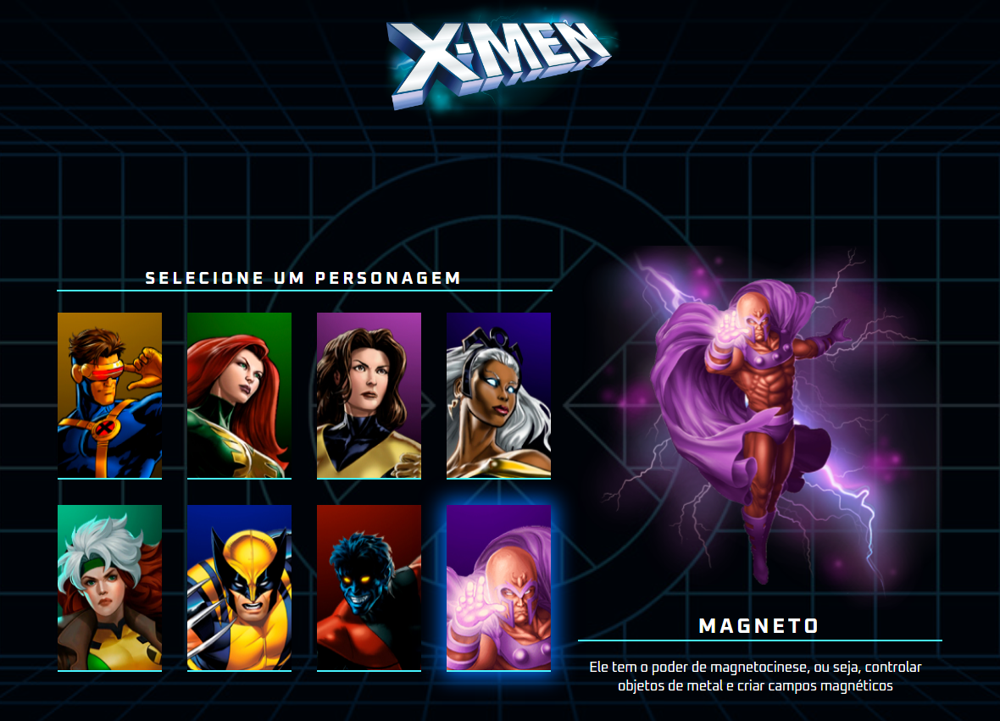

# :open_book: Projeto Catálogo X-Men :open_book:

Projeto desenvolvido durante a [SEMANA DO ZERO AO PROGRAMADOR CONTRATADO] ministrado por [@Dev em Dobro](https://github.com/devemdobro).

## Tecnologias Utilizadas

* HTML5
* CSS3
* JavaScript

